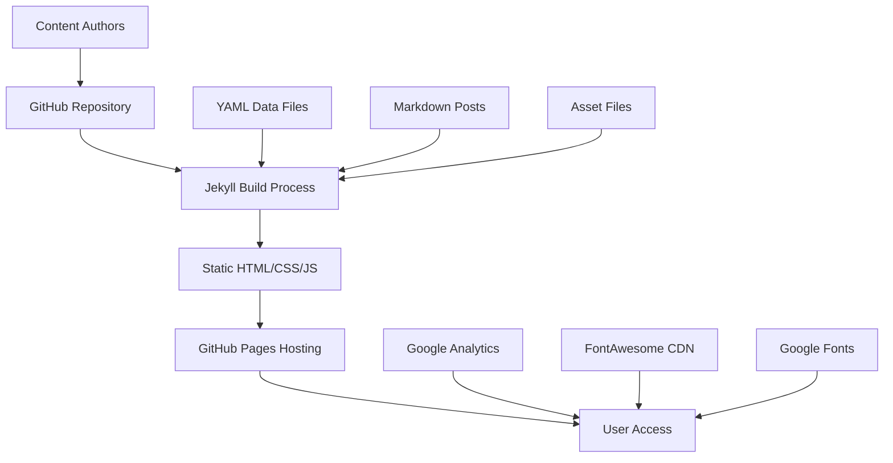
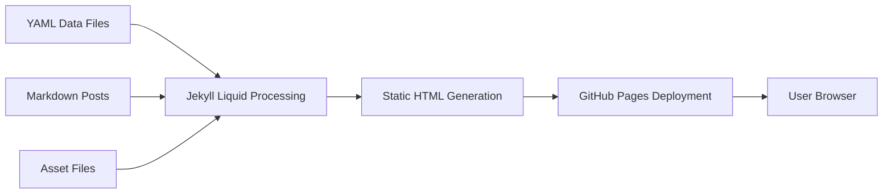

# Current System Architecture

## System Overview

The KhoiDLy.github.io system is a **static site generator architecture** built on Jekyll, designed for academic portfolio presentation with research project showcase capabilities.



## Core Components

### 1. Content Management Layer
- **Jekyll Static Site Generator**: Core engine for site generation
- **Markdown Content System**: Research projects, blog posts, design showcases
- **YAML Data Layer**: Structured CV and professional information
- **Asset Management**: Images, fonts, PDFs, and media files

### 2. Presentation Layer
- **Bootstrap 4.0.0-beta**: Responsive framework foundation
- **Custom CSS Architecture**: 1600+ line main.css with Bootstrap overrides
- **Montserrat Typography**: Local font family with multiple weights
- **jQuery 3.2.1**: DOM manipulation and interactive features

### 3. Deployment Infrastructure
- **GitHub Pages**: Automated hosting and deployment
- **Git-based Workflow**: Version control and content management
- **Custom Domain**: Professional branding via CNAME configuration

## Data Architecture

### Content Organization Structure
```
Content Types:
├── Research Projects (Categorized)
│   ├── Embedded power and sensor design
│   ├── Embodied energy system 
│   ├── Integrated system and controller design
│   └── Other projects
├── Publications (Academic Papers)
├── Design Projects (Visual Portfolio)
├── Blog Posts (Technical Writing)
└── CV Data (Professional Information)
```

### Data Flow Architecture

