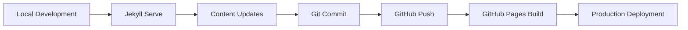

# Development and Deployment Architecture

## Current Development Workflow

## Enhanced Development Architecture
- **Local Development Environment**: Docker-based development setup
- **Automated Testing**: Content validation and link checking
- **CI/CD Pipeline**: Automated testing and deployment
- **Environment Management**: Development, staging, and production environments
