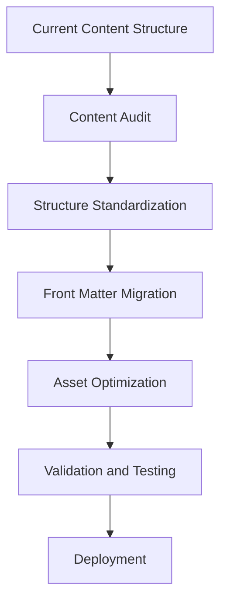

# Enhancement Architecture Strategy

## Progressive Enhancement Approach

### Phase 1: Foundation Modernization
**Goal**: Address critical technical debt while maintaining functionality

**Architecture Changes**:
- Implement modular CSS architecture
- Standardize content organization
- Optimize asset loading and performance
- Add automated testing framework

**Integration Strategy**:
- Maintain GitHub Pages compatibility
- Preserve existing URL structure
- Implement feature flags for gradual rollout
- Add monitoring and analytics

### Phase 2: User Experience Enhancement
**Goal**: Improve user experience and site performance

**Architecture Changes**:
- Implement responsive design improvements
- Add search functionality
- Enhance navigation and information architecture
- Implement accessibility improvements

**Integration Strategy**:
- Progressive enhancement for new features
- Backward compatibility for existing functionality
- Performance monitoring and optimization
- User feedback collection system

### Phase 3: Advanced Features Integration
**Goal**: Add advanced features and external integrations

**Architecture Changes**:
- Implement advanced content filtering and search
- Add social media integration
- Create interactive elements and animations
- Implement advanced analytics and tracking

**Integration Strategy**:
- API integration for external services
- Real-time data synchronization
- Advanced caching strategies
- Security enhancements

## Migration Architecture

### Content Migration Strategy

### Data Migration Approach
1. **Audit Phase**: Document current content structure and patterns
2. **Standardization Phase**: Create consistent content templates
3. **Migration Phase**: Transform existing content to new structure
4. **Validation Phase**: Verify content integrity and functionality
5. **Deployment Phase**: Gradual rollout with rollback capability

## Compatibility Architecture

### Backward Compatibility Requirements
- Maintain existing URL structure and routing
- Preserve current functionality and user workflows
- Support existing content formats and data structures
- Ensure GitHub Pages deployment compatibility

### Forward Compatibility Strategy
- Design for extensibility and future enhancements
- Implement modular architecture for easy updates
- Create clear upgrade paths for major changes
- Document migration procedures and best practices
