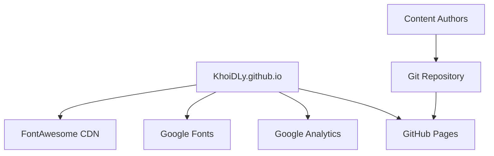
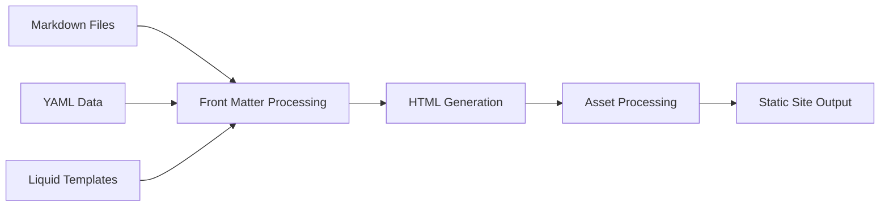

# Integration Architecture

## External Service Integration

### Current Integrations

### Integration Patterns
1. **GitHub Pages Integration**: Git-based deployment with automatic builds
2. **Analytics Integration**: Google Analytics tracking via JavaScript snippet
3. **CDN Integration**: FontAwesome icons and Google Fonts via CDN
4. **Custom Domain**: Professional branding via CNAME configuration

## Internal Integration Points

### Jekyll Processing Pipeline

### Data Binding Architecture
- **Liquid Templating**: Dynamic content rendering from YAML data
- **Front Matter Processing**: Metadata extraction from Markdown files
- **Asset Pipeline**: Image optimization and font processing
- **Build Optimization**: Minification and compression
