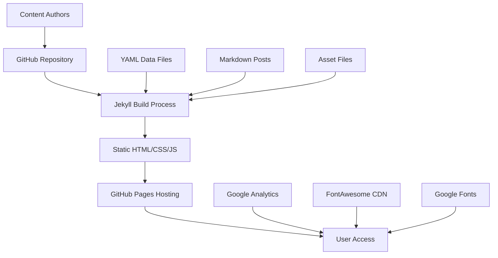
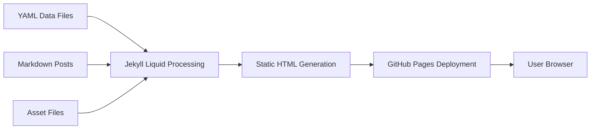
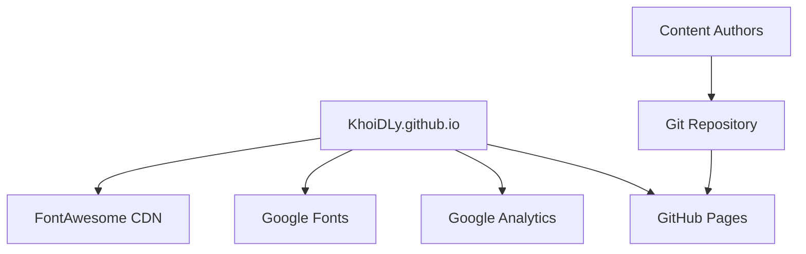
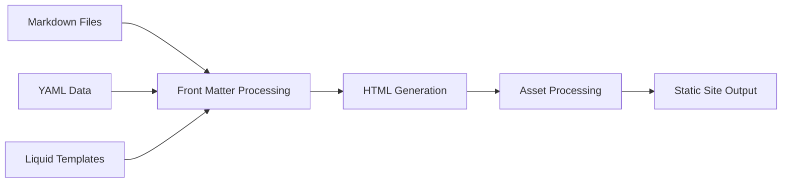
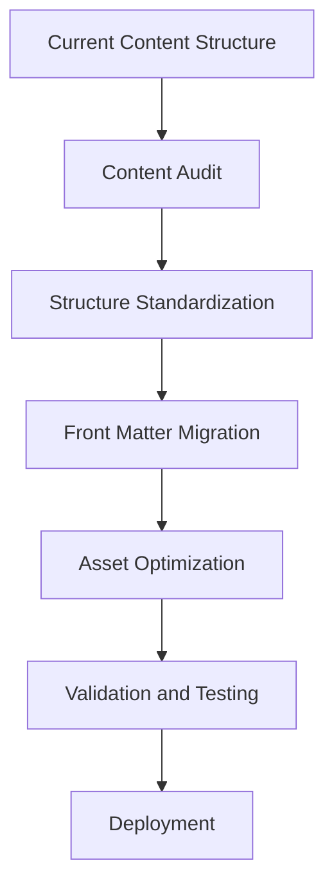
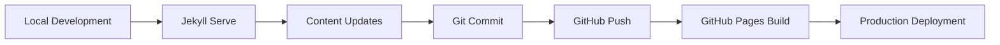

# KhoiDLy.github.io Brownfield Architecture Document

## Document Information

| Field | Value |
|-------|-------|
| **Document Title** | KhoiDLy.github.io Brownfield Architecture |
| **Version** | 2.0 |
| **Date** | 2024-12-19 |
| **Author** | Winston (Architect) |
| **Status** | Active |
| **Related Documents** | [Brownfield PRD](./brownfield-prd.md) |

## Executive Summary

This brownfield architecture document provides a comprehensive technical blueprint for enhancing the existing KhoiDLy.github.io academic portfolio website. The current system is a Jekyll-based static site serving as Dr. Khoi Dang Ly's professional presence, showcasing research in soft robotics, publications, and academic achievements.

**Key Architectural Principles:**
- Preserve existing functionality while enabling modern enhancements
- Maintain GitHub Pages compatibility and deployment simplicity
- Respect academic portfolio requirements and professional presentation standards
- Implement progressive enhancement strategies for new features
- Cleaning up unused files

## Current System Architecture

### System Overview

The KhoiDLy.github.io system is a **static site generator architecture** built on Jekyll, designed for academic portfolio presentation with research project showcase capabilities.



### Core Components

#### 1. Content Management Layer
- **Jekyll Static Site Generator**: Core engine for site generation
- **Markdown Content System**: Research projects, blog posts, design showcases
- **YAML Data Layer**: Structured CV and professional information
- **Asset Management**: Images, fonts, PDFs, and media files

#### 2. Presentation Layer
- **Bootstrap 4.0.0-beta**: Responsive framework foundation
- **Custom CSS Architecture**: 1600+ line main.css with Bootstrap overrides
- **Montserrat Typography**: Local font family with multiple weights
- **jQuery 3.2.1**: DOM manipulation and interactive features

#### 3. Deployment Infrastructure
- **GitHub Pages**: Automated hosting and deployment
- **Git-based Workflow**: Version control and content management
- **Custom Domain**: Professional branding via CNAME configuration

### Data Architecture

#### Content Organization Structure
```
Content Types:
├── Research Projects (Categorized)
│   ├── Embedded power and sensor design
│   ├── Embodied energy system 
│   ├── Integrated system and controller design
│   └── Other projects
├── Publications (Academic Papers)
├── Design Projects (Visual Portfolio)
├── Blog Posts (Technical Writing)
└── CV Data (Professional Information)
```

#### Data Flow Architecture


## Technical Debt Analysis

### Critical Technical Debt Items

#### 1. CSS Architecture Debt
**Current State**: Monolithic `main.css` (1600+ lines)
**Issues**:
- Mixing Bootstrap overrides with custom styles
- No modular organization
- Difficult maintenance and debugging
- Performance impact from unminified CSS

**Remediation Strategy**:
- Implement CSS module architecture
- Separate Bootstrap customizations from component styles
- Add CSS minification and optimization
- Create style guide documentation

#### 2. Content Organization Debt
**Current State**: Mixed content structure across directories
**Issues**:
- Research projects split between `_posts/research/` subdirectories
- Inconsistent front matter patterns
- Hardcoded image paths in templates
- Complex conditional rendering logic

**Remediation Strategy**:
- Standardize content structure and front matter
- Implement dynamic image path resolution
- Create content templates and validation
- Simplify conditional rendering logic

#### 3. Navigation Architecture Debt
**Current State**: Hardcoded navigation with complex conditionals
**Issues**:
- Navigation logic embedded in `_includes/header.html`
- Complex page type conditionals
- Difficult to maintain and extend
- No dynamic menu generation

**Remediation Strategy**:
- Implement data-driven navigation system
- Create navigation configuration in YAML
- Simplify page type logic
- Add breadcrumb and search functionality

#### 4. Asset Management Debt
**Current State**: Local asset hosting with manual optimization
**Issues**:
- No automated image optimization
- Multiple font weights loaded simultaneously
- No lazy loading for portfolio images
- Manual asset management processes

**Remediation Strategy**:
- Implement automated image optimization pipeline
- Optimize font loading strategy
- Add lazy loading for images
- Create asset management automation

### Performance Debt Analysis

#### Current Performance Bottlenecks
1. **CSS Loading**: Large unminified CSS file impacts initial page load
2. **Font Loading**: Multiple Montserrat weights loaded simultaneously
3. **Image Loading**: No lazy loading for portfolio images
4. **JavaScript Loading**: Multiple jQuery plugins loaded on every page

#### Performance Optimization Strategy
- Implement critical CSS inlining
- Optimize font loading with font-display: swap
- Add image lazy loading and WebP conversion
- Implement JavaScript code splitting and lazy loading

## Integration Architecture

### External Service Integration

#### Current Integrations


#### Integration Patterns
1. **GitHub Pages Integration**: Git-based deployment with automatic builds
2. **Analytics Integration**: Google Analytics tracking via JavaScript snippet
3. **CDN Integration**: FontAwesome icons and Google Fonts via CDN
4. **Custom Domain**: Professional branding via CNAME configuration

### Internal Integration Points

#### Jekyll Processing Pipeline


#### Data Binding Architecture
- **Liquid Templating**: Dynamic content rendering from YAML data
- **Front Matter Processing**: Metadata extraction from Markdown files
- **Asset Pipeline**: Image optimization and font processing
- **Build Optimization**: Minification and compression

## Enhancement Architecture Strategy

### Progressive Enhancement Approach

#### Phase 1: Foundation Modernization
**Goal**: Address critical technical debt while maintaining functionality

**Architecture Changes**:
- Implement modular CSS architecture
- Standardize content organization
- Optimize asset loading and performance
- Add automated testing framework

**Integration Strategy**:
- Maintain GitHub Pages compatibility
- Preserve existing URL structure
- Implement feature flags for gradual rollout
- Add monitoring and analytics

#### Phase 2: User Experience Enhancement
**Goal**: Improve user experience and site performance

**Architecture Changes**:
- Implement responsive design improvements
- Add search functionality
- Enhance navigation and information architecture
- Implement accessibility improvements

**Integration Strategy**:
- Progressive enhancement for new features
- Backward compatibility for existing functionality
- Performance monitoring and optimization
- User feedback collection system

#### Phase 3: Advanced Features Integration
**Goal**: Add advanced features and external integrations

**Architecture Changes**:
- Implement advanced content filtering and search
- Add social media integration
- Create interactive elements and animations
- Implement advanced analytics and tracking

**Integration Strategy**:
- API integration for external services
- Real-time data synchronization
- Advanced caching strategies
- Security enhancements

### Migration Architecture

#### Content Migration Strategy


#### Data Migration Approach
1. **Audit Phase**: Document current content structure and patterns
2. **Standardization Phase**: Create consistent content templates
3. **Migration Phase**: Transform existing content to new structure
4. **Validation Phase**: Verify content integrity and functionality
5. **Deployment Phase**: Gradual rollout with rollback capability

### Compatibility Architecture

#### Backward Compatibility Requirements
- Maintain existing URL structure and routing
- Preserve current functionality and user workflows
- Support existing content formats and data structures
- Ensure GitHub Pages deployment compatibility

#### Forward Compatibility Strategy
- Design for extensibility and future enhancements
- Implement modular architecture for easy updates
- Create clear upgrade paths for major changes
- Document migration procedures and best practices

## Security Architecture

### Current Security Posture
- **HTTPS Enforcement**: Automatic via GitHub Pages
- **Content Security Policy**: Not implemented
- **Input Validation**: Limited (static site)
- **Dependency Management**: Manual updates

### Security Enhancement Strategy
- Implement Content Security Policy (CSP)
- Add security headers and best practices
- Implement dependency vulnerability scanning
- Create security monitoring and alerting

## Monitoring and Observability

### Current Monitoring
- **Google Analytics**: Basic usage tracking
- **GitHub Pages**: Built-in deployment monitoring
- **Manual Testing**: Visual inspection and manual validation

### Enhanced Monitoring Strategy
- **Performance Monitoring**: Core Web Vitals tracking
- **Error Monitoring**: Client-side error tracking
- **Uptime Monitoring**: Site availability monitoring
- **Content Monitoring**: Link checking and content validation

## Development and Deployment Architecture

### Current Development Workflow


### Enhanced Development Architecture
- **Local Development Environment**: Docker-based development setup
- **Automated Testing**: Content validation and link checking
- **CI/CD Pipeline**: Automated testing and deployment
- **Environment Management**: Development, staging, and production environments

## Risk Assessment and Mitigation

### High-Risk Areas

#### 1. Content Migration Risk
**Risk**: Data loss or corruption during content structure changes
**Mitigation**: Comprehensive backup strategy and gradual migration
**Contingency**: Rollback procedures and data recovery plans

#### 2. Performance Regression Risk
**Risk**: New features may impact site performance
**Mitigation**: Performance testing and monitoring
**Contingency**: Performance optimization sprint and rollback capability

#### 3. GitHub Pages Compatibility Risk
**Risk**: Changes may break GitHub Pages deployment
**Mitigation**: Compatibility testing and validation
**Contingency**: Alternative hosting options and migration plans

### Medium-Risk Areas

#### 1. User Experience Disruption Risk
**Risk**: Changes may confuse existing users
**Mitigation**: Gradual rollout and user communication
**Contingency**: User feedback collection and rapid iteration

#### 2. SEO Impact Risk
**Risk**: Changes may impact search engine rankings
**Mitigation**: SEO preservation and monitoring
**Contingency**: SEO recovery strategies and optimization

## Implementation Roadmap

### Phase 1: Foundation (Weeks 1-4)
- CSS architecture modernization
- Content organization standardization
- Performance optimization implementation
- Testing framework establishment

### Phase 2: Enhancement (Weeks 5-8)
- User experience improvements
- Navigation and search functionality
- Accessibility enhancements
- Performance monitoring implementation

### Phase 3: Advanced Features (Weeks 9-12)
- Advanced content features
- External service integrations
- Security enhancements
- Monitoring and analytics

### Phase 4: Optimization (Ongoing)
- Continuous performance optimization
- Security updates and monitoring
- Content management improvements
- User feedback integration

## Success Metrics

### Technical Metrics
- **Performance**: Page load time < 3 seconds
- **Accessibility**: WCAG 2.1 AA compliance
- **SEO**: Maintain or improve search rankings
- **Uptime**: 99.9% availability

### User Experience Metrics
- **Engagement**: Increased time on site
- **Conversion**: Higher contact form completion
- **Discovery**: Improved organic search traffic
- **Satisfaction**: User feedback and ratings

## Conclusion

This brownfield architecture document provides a comprehensive roadmap for enhancing the KhoiDLy.github.io academic portfolio website while preserving existing functionality and maintaining professional standards. The progressive enhancement approach ensures minimal disruption while enabling significant improvements in user experience, performance, and maintainability.

The architecture emphasizes:
- **Preservation**: Maintaining existing functionality and user workflows
- **Enhancement**: Adding modern features and capabilities
- **Optimization**: Improving performance and user experience
- **Sustainability**: Creating maintainable and extensible systems

By following this architecture, the development team can successfully modernize the existing system while respecting the constraints and requirements of the academic portfolio context.

---

**Document Control**
- **Next Review Date**: 2025-01-19
- **Approval Required**: Dr. Khoi Dang Ly
- **Distribution**: Development team, stakeholders
- **Version History**: See change log in document header
